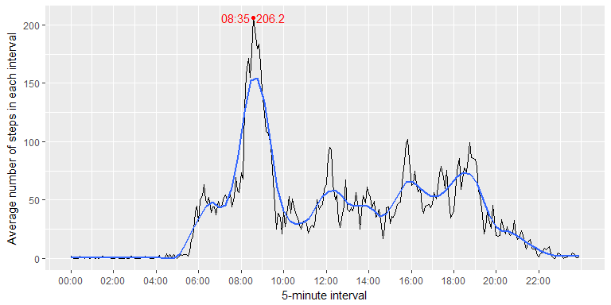

## Loading and preprocessing the data


```r
library(tidyverse)
library(lubridate)
library(hms)
```
Assuming `activity.zip` is already in the working directory I start by reading in the data (the data could be downloaded from [here](https://d396qusza40orc.cloudfront.net/repdata%2Fdata%2Factivity.zip)):


```r
# read_csv automatically uncompress .zip files and identifies column types
activity <- read_csv("activity.zip")
head(activity)
```

```
## # A tibble: 6 x 3
##   steps       date interval
##   <int>     <date>    <int>
## 1    NA 2012-10-01        0
## 2    NA 2012-10-01        5
## 3    NA 2012-10-01       10
## 4    NA 2012-10-01       15
## 5    NA 2012-10-01       20
## 6    NA 2012-10-01       25
```

The variables included in this dataset are:

* `steps`: Number of steps taken in a 5-minute interval (missing values are
coded as NA).

* `date`: The date on which the measurement was taken in YYYY-MM-DD
format.

* `interval`: Identifier for the 5-minute interval in which measurement was
taken.

There are a total of 17,568 observations in this dataset.

The data are already in a tidy format for further analysis except for the `interval` column. The time intervals are represented in an inappropriate format. R doesn't have a native class for dealing with times. We can join `date` and `interval` together and store the results in a column with date-time class. But I found it more efficient to use **hms** package which offers a class for storing time values.


```r
activity <- activity %>%
    mutate(interval = hms::hms(hour = interval %/% 100,
                           min  = interval %% 100)) %>%
    select(date, interval, steps)
```

## What is mean total number of steps taken per day?

Here's a histogram of the total number of steps taken each day:


```r
by_date <- activity %>% 
    filter(!is.na(steps)) %>%
    group_by(date) %>%
    summarise(steps = sum(steps))

by_date %>%
    ggplot(aes(steps)) +
    geom_histogram(binwidth = 1000, color = "black", fill = "grey", boundary = 0) +
    labs(
        x = "Steps per day",
        y = "The count of days"
    ) +
    scale_y_continuous(breaks = 1:10) +
    scale_x_continuous(breaks = seq(0, 22000, by = 2000))
```


There are two days in which the total number of steps are more than 20,000. That translates to probably more than 4.5 hours of walking. I guess it happened during weekends:


```r
by_date %>%
    filter(steps > 20000) %>%
    mutate(wday = wday(date, label = TRUE))
```

```
## # A tibble: 2 x 3
##         date steps  wday
##       <date> <int> <ord>
## 1 2012-11-22 20427 Thurs
## 2 2012-11-23 21194   Fri
```

Looks like I was wrong! But it's interesting to know those two days were consecutive.

There are also two days in which the total number steps are less than 1000. Let's look into them: 


```r
by_date %>%
    filter(steps < 1000) %>%
    mutate(wday = wday(date, label = TRUE))
```

```
## # A tibble: 2 x 3
##         date steps  wday
##       <date> <int> <ord>
## 1 2012-10-02   126  Tues
## 2 2012-11-15    41 Thurs
```

In these two days the total number of steps are oddly low. To explore this further I can filter out all intervals in these two days in which the number of steps are non-zero. But since it's out of the scope this report, I won't dig any further.

Getting back to the assignment rubric, let's calculate the mean and median total number of steps taken per day:


```r
by_date %>%
    summarise(median = median(steps), mean = mean(steps))
```

```
## # A tibble: 1 x 2
##   median     mean
##    <int>    <dbl>
## 1  10765 10766.19
```

The mean and the median are roughly equal which again points to the normality of the distribution of daily steps.

## What is the average daily activity pattern?

I will inspect the average daily activity pattern with a times series plot of the 5-minute interval versus the average number of steps taken, averaged across all days. The time series plot for 5-minute intervals will be highly variable which makes it hard to see the trend over the course of a day. We can highlight that trend by overlaying a `loess` curve:


```r
by_interval <- activity %>%
    filter(!is.na(steps)) %>%
    group_by(interval) %>%
    summarise(avg_steps = mean(steps))

max_entry <- by_interval %>%
    slice(which.max(.$avg_steps))

annotation <- mutate(
    max_entry,
    interval = format(as.POSIXlt(interval), "%H:%M"),
    avg_steps = round(avg_steps, digits = 1)
    ) %>% 
    paste(collapse = "  ")

by_interval %>%
    ggplot(aes(interval, avg_steps)) +
    geom_line() +
    scale_x_time(
        breaks = hms(hours = seq(0, 22, by = 2)),
        labels = format(as.POSIXlt(hms(hour = seq(0,22,2))), "%H:%M")
    ) +
    labs(
        x = "5-minute interval",
        y = "Average number of steps in each interval"
    ) +
    geom_smooth(method = "loess", span = 0.15, se = FALSE) +
    geom_point(data = max_entry, color = "red") +
    geom_text(data = max_entry, label = annotation, color = "red")
```



The main takeaway I get from this graph is the sleep pattern of the subject: He clearly wakes up around 5:30 and normally sleeps after 22:00. The other distinct feature of the plot is the surge of activity between 8:00 and 9:30. Maybe the subject walks to work in this interval or is going for a morning run. I will get back to this speculation later. The 5-minute interval which contains the maximum number of average steps is distinguished with a red label.

## Imputing missing values

There are a number of days/intervals where there are missing values (coded as NA). The presence of missing days may introduce bias into some calculations or summaries of the data. First, let's calculate the total number of missing values in each column of the dataset:


```r
map_int(activity, ~ sum(is.na(.x)))
```

```
##     date interval    steps 
##        0        0     2304
```

There are 2304 `NA`s in the dataset every which of them is in the `steps` column. We can get some hint of the distribution of the `NA` values in the `steps` column by binning in two dimensions and adjusting bins widths such that each bin represents one data point. Then we can use fill colors to display if each points is `NA` or not.


```r
activity %>%
    mutate(is_na = is.na(steps)) %>%
    ggplot(aes(date, interval)) +
    geom_bin2d(aes(fill = is_na), binwidth = c(1, 300)) +
    scale_fill_manual(values = c("TRUE"= "dark grey","FALSE"= "light grey"))
```


My strategy for imputing missing values is simply to replace NA values with the average of all non-NA values for the same 5-minute interval across all days. This will cause the total number of steps for every missing day to be equal to the average daily steps. So the mean of average daily steps won't change.


```r
activity_imputed <- activity %>%
    group_by(interval) %>%
    mutate(steps = ifelse(is.na(steps), mean(steps, na.rm=TRUE), steps))

by_date2 <- activity_imputed %>% 
    group_by(date) %>%
    summarise(steps = sum(steps))

label <- tibble(
  steps = Inf,
  y = 19,
  label = "the blue bar is associated \n with the filled in missing days. "
)


ggplot(data = by_date2, aes(steps)) +
    geom_histogram(
        binwidth = 1000, color = "blue", fill = "blue", boundary = 0, alpha = 0.3
    ) +
    geom_histogram(
        data = by_date, 
        binwidth = 1000, color = "red", fill = "red", boundary = 0, alpha = 0.3
    ) +
    labs(
        x = "Steps per day",
        y = "The count of days"
    ) +
    scale_y_continuous(breaks = 1:18) +
    scale_x_continuous(breaks = seq(0, 22000, by = 2000)) +
    geom_text(aes(label = label, y = y), data = label,
              size = 4, vjust = "top", hjust = "right")
```


Now let's compute mean and median for the new data:


```r
by_date2 %>%
    summarise(median = median(steps), mean = mean(steps))
```

```
## # A tibble: 1 x 2
##     median     mean
##      <dbl>    <dbl>
## 1 10766.19 10766.19
```

Although the mean and median don't differ from the first part of the assignment, other summaries such as variance have changed.

## Are there differences in activity patterns between weekdays and weekends?

Previously we tried a time series plot to investigate the average daily activity but we couldn't deduce much from the averaged activity pattern. People tend to follow different schedules during weekdays and weekends. So one way to improve on our previous attempt is to average the number of steps taken across all weekday days and weekend days separately. Let's create a variable that divides `date` into two groups: `weekday` and `weekend`, and then check our work with a plot:


```r
activity2 <- activity_imputed %>%
    mutate(day_type = ifelse(wday(date) %in% c(1,7), "weekend", "weekday"))

activity2 %>%
    group_by(interval, day_type) %>% 
    summarise(mean = mean(steps)) %>%
    ggplot(aes(interval, mean)) +
    geom_line() +
    scale_x_time(
        breaks = hms(hours = seq(0, 22, by = 2)),
        labels = format(as.POSIXlt(hms(hour = seq(0,22,2))), "%H:%M")
    ) +
    labs(
        x = "5-minute interval",
        y = "Average number of steps in each interval"
    ) +
    geom_smooth(method = "loess", span = 0.15, se = FALSE) +
    facet_wrap(~day_type, nrow = 2)
```


Looking at the plot above, I can deduce two facts: The subject is generally more active during the weekdays than on the weekends and he doesn't wake up at a specific time on the weekends and usually sleeps in. In my opinion if we've plotted both groups in one panel, it would've been more informative.

Now let's get back to our former hypotheses about the reason behind the morning activity surge. After some research I figured out any pace less than 150 steps per minute is not a running gait anymore and even a slow walk is more than 80 steps per minute^[[http://www.ontherunevents.com/ns0060.htm](http://www.ontherunevents.com/ns0060.htm)] which amounts to 400 step per 5-minute. So 200 steps per 5-minute could neither be running nor walking. But notice that we plotted the average activity. Instead we have to look into individual days to infer the type of activity from the number of steps. Here I reorder the data based on `steps`:


```r
activity %>%
    arrange(desc(steps)) %>%
    head
```

```
## # A tibble: 6 x 3
##         date interval steps
##       <date>   <time> <int>
## 1 2012-11-27 06:15:00   806
## 2 2012-10-12 09:00:00   802
## 3 2012-11-27 05:50:00   794
## 4 2012-11-19 07:20:00   789
## 5 2012-10-15 08:35:00   786
## 6 2012-11-05 09:25:00   785
```

Looks like we've recognized running activity but we still need to try more tricks to determine the type of activity. I won't push anymore because I think we don't have the right data to answer this question.

